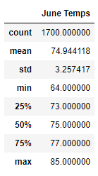
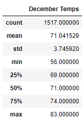

# surfs_up

## Overview of the analysis
This analysis is to get temperature data for the months of June and December in Oahu, in order to determine if the surf and ice cream shop business is sustainable year-round.

## Results

As we can tell from the results above, there are more data in June than in December. The mean in June is greater than that in December by about 3 degrees, the maximum temperature in June is greater than that in December by 2 degrees, and the minimun temperature in June is greater than that in December by 8 degrees. The standard deviation in December is greater, meaning the temperature varies more in December than in June.

## Summary

The two queries we can perform are:
- divide each month to several parts and see if the standard deviation is less.
- query the precipitation for the two months
